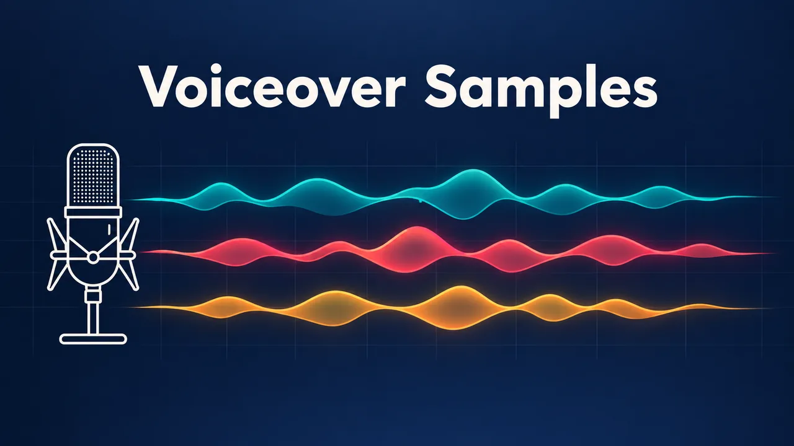

# AI Voiceover Generator Skill

English | [简体中文](./README.zh-CN.md)

Pick or reuse a voice, turn scripts into narration ready for editing, plan ordered long-form or multilingual audio, and create a reusable custom voice, from inside Claude Code, Codex, or OpenClaw.

> [!IMPORTANT]
> Rendering needs a [Beatra](https://beatra.ai) account and uses credits. The skill itself is free to install.

| Question | Answer |
| --- | --- |
| **What it does** | Choose or reuse a voice, turn scripts into ready-to-edit narration, plan ordered long-form or multilingual audio, and create a reusable custom voice. |
| **Requirements** | Python 3.10+ and an agent that loads `SKILL.md` |
| **Cost** | Free to install. Each render uses credits on your Beatra account, and paid steps run only when you ask for that exact render or approve its card. |
| **Works with** | Claude Code, Codex, OpenClaw |

<p align="center"></p>

*A narration studio cover with a microphone and three colored waveforms, one for each voice in the sample. AI-generated with Beatra.*

| Skill | Entry point | Version |
| --- | --- | --- |
| [`voiceover-narration-studio`](skills/voiceover-narration-studio) | [SKILL.md](skills/voiceover-narration-studio/SKILL.md) | 0.1.9 |

This repository is published automatically from [beatra-ai/beatra-skills](https://github.com/beatra-ai/beatra-skills/tree/main/skills/voiceover-narration-studio). Report issues there.

## Install

With the [`skills`](https://skills.sh) CLI:

```bash
npx skills add beatra-ai/ai-voiceover-generator-skill
```

With the GitHub CLI:

```bash
gh skill install beatra-ai/ai-voiceover-generator-skill voiceover-narration-studio
```

Or clone this repository and copy `skills/voiceover-narration-studio` into `~/.claude/skills/` for Claude Code,
`~/.agents/skills/` for Codex, or `~/.openclaw/skills/` for OpenClaw.

Or paste this into your agent:

```text
Install the voiceover-narration-studio skill from https://github.com/beatra-ai/ai-voiceover-generator-skill (folder skills/voiceover-narration-studio), then follow its SKILL.md to connect my Beatra account.
```

## Examples

<p align="center"></p>

[▶ Listen (MP3)](assets/sample.mp3)

*Three short reads in three preset voices, in order: a calm product explainer, an upbeat short-video ad, and a documentary line, 41 seconds in total. AI-generated with Beatra.*

Prompt:

```text
Meet Tidewell, a desk lamp that follows your day. In the morning, it glows cool and bright for focus. After sunset, it turns warmer, so your eyes can rest.

Okay, stop scrolling! Crunchlane spicy mango chips are here: sweet, hot, and seriously crunchy. Grab a bag this Saturday, and tell us how fast it disappeared!

High in the northern mountains, the first snow falls without a sound. A red fox stops and listens. Something small is moving beneath the snow. She waits. Then she leaps.
```

## What you get

- **Choose the right route first** — Start with a single voiceover, ordered long-form work, supplied multilingual scripts, or a reusable custom voice and keep each route easy to follow.
- **Use a current voice** — Compare only voices that fit the language and use, and keep a selected voice consistent across continuing content.
- **Keep long-form audio organized** — Arrange chapters, lessons, languages, and recurring reads in a clear sequence so every delivered audio item is easy to find and edit.

## Use cases

- **Short-video voiceover** — Turn a script into one ready-to-edit read with a voice and pace chosen for the audience.
- **Audiobooks and course narration** — Pilot a supplied passage, then keep chapters or lessons ordered with one accepted narrator.
- **Supplied multilingual scripts** — Choose a suitable voice for each prepared language version and keep the resulting audio grouped by language and section.
- **A reusable brand voice** — Create a named custom voice from a clean sample, then choose it again for later narration.

## FAQ

### What can I make in the Voice Studio?

You can make a single voiceover, ordered audiobook or course narration, audio from supplied multilingual scripts, or a reusable custom voice for later narration.

### How many languages are available?

Current live speech models cover 40 languages, including Mandarin Chinese and Cantonese. Each production still checks both the selected current voice and the speech model for the requested language.

### Can I use my own voice?

Yes. Use a clean single-speaker sample to create a named custom voice, then select it again for later narration, courses, updates, and recurring brand content.

### How are long-form and multilingual projects organized?

Audio is arranged by chapter, lesson, language, market, or recurring use case, making each delivered item easy to review, edit, and reuse.

## Updates

Each installed skill checks for a new version at most once a day, verifies the
official archive before replacing itself, and leaves your installation untouched
if anything fails. Turn it off at any time — see
`references/automatic-updates-and-safety.md` inside the skill.

## License

[MIT-0](LICENSE) — free to use, modify, and redistribute, including
commercially. No attribution required. Same terms as these skills carry on
ClawHub.
